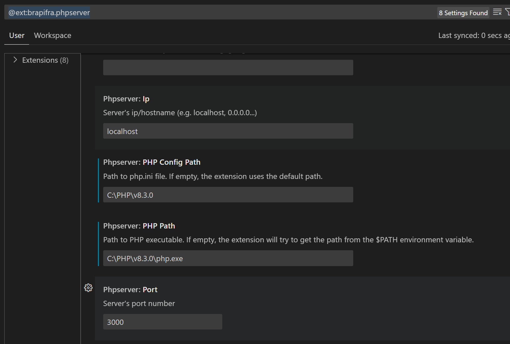
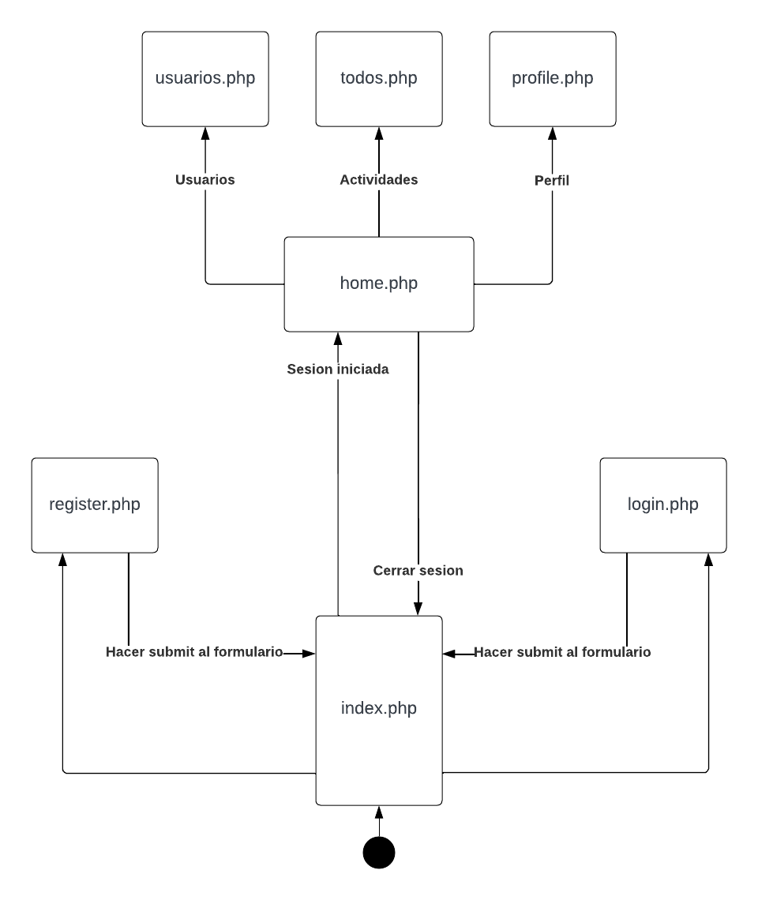

# PHP

## Como correr el proyecto

1. Descargar el zip de [PHP](https://www.php.net/downloads.php).
2. Descomprimir el zip de PHP en el directorio de su preferencia. Yo lo hice en `C:\PHP\v8.3.0`. 
2. Abrir el proyecto en VS Code.
3. Instalar la extension `PHP Server`.
4. Configurar la extension para usar el PHP que descargaron previamente.

4. Abrir el archivo `index.php`.
5. Dar click derecho en un espacio vacio dentro de `index.php` y escoger la opcion `PHP Server: Serve Project`.

## Flujo de la aplicacion

